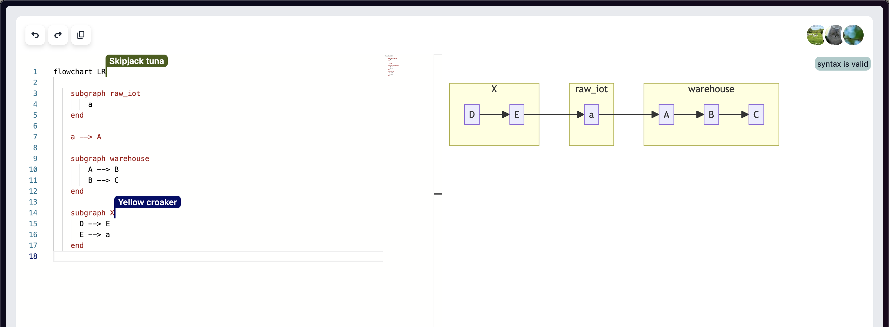

# Mermaid School

Welcome fishies! With this app, you will learn to dive into the ocean of diagrams with Mermaid. Swim alongside fellow learners and navigate the currents of diagramming together! 🌊

What is Mermaid?

If you don't know already, here's an official definition from [MermaidJS](https://mermaid.js.org/)

> Mermaid is a JavaScript based diagramming and charting tool that renders Markdown-inspired text definitions to create and modify diagrams dynamically.

## Here's a screenshot of how it will be like

## 🛠️ Tech Stack

- **Fullstack**: NextJS
- **Realtime Collaboration**: Liveblocks
- **Code Editor**: Monaco Editor (Visual Studio Code-based)
- **Diagramming Tool**: MermaidJS

## ✨ Features

### Interactive Learning Environment

Collaborate, share, and learn together in realtime.

### Monaco Editor Integration
Enjoy a familiar coding experience with the Monaco Editor. Key features include:
- **Undo/Redo**: Standard keyboard shortcuts (Cmd+Z for undo, Ctrl+D for duplicate lines)
- **Ease of Use**: An intuitive interface that mirrors Visual Studio Code

### Mermaid Live Preview
As you write your MermaidJS syntax, watch your diagrams come to life:
- **Real-time Visualization**: Immediate preview next to your code
- **Error Handling**: The app continues to show the last valid diagram with an indicator for syntax errors, enhancing the learning experience

## Future Improvements

- Enhanced Responsive Design: Improve the layout for mobile users, ensuring a seamless experience across all devices
- User Authentication: Allow fishie captains to create their own private schools.
- Dynamic work areas: Introduce the ability to add multiple editors and diagram previews concurrently, facilitating complex projects and collaborative learning

## Resources

For more resources, check out [this padlet](https://padlet.com/senchatea/mermaid-3l2jbgazxyifdm57)